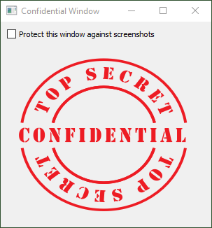

SPDX-License-Identifier: GPL-3.0-or-later
Copyright (C) 2022 Pedro López-Cabanillas <plcl@users.sourceforge.net>

From time to time, every developer has been requested to disable the "PrtScr" key on some bussiness application.
This is justified by the user on some incident involving a screenshot of the appplication's window 
taken with the "PrtScr" key, and pasted on an email message which was sent to the outside world. 

Because that key was involved, and looks like an easy target, the user designs its own solution and leaves you
only the menial task of programming his brilliant idea. 

Depending on who the user is and how much trust you have with him, you may show him the the existence of programs 
like the "Snipping Tool", or the Windows 10' "Snip & Sketch", to take screenshots without using the "PrtScr" key.
And there is the danger of programs like Teams, with screen sharing functions, that may also unwantedly reveal information to outsiders.

Anyway, Raymond Chen has written about this issue that "Ultimately, you can’t stop somebody from ignoring the words 
Confidential at the top of a document and whipping out a digital camera and taking a picture of the screen. 
But at least starting in Windows 7 you can make it a little more difficult."

References:

How do I make it more difficult for somebody to take a screenshot of my window? (Raymond Chen)
https://devblogs.microsoft.com/oldnewthing/20130603-00/?p=4193

Windows Confidential: What You See Is What You See (Raymond Chen)
https://docs.microsoft.com/en-us/previous-versions/technet-magazine/hh241037(v=msdn.10)?redirectedfrom=MSDN

SetWindowDisplayAffinity function (winuser.h)
https://docs.microsoft.com/en-us/windows/win32/api/winuser/nf-winuser-setwindowdisplayaffinity

Illustration: https://freesvg.org/top-secret-confidential-sticker
License: CC0-1.0 Public Domain https://creativecommons.org/publicdomain/zero/1.0/
